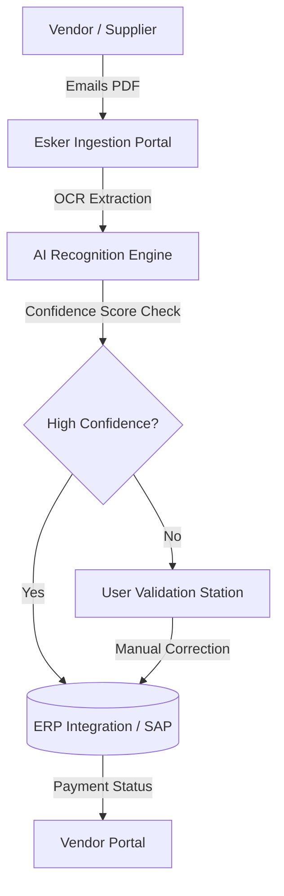

Standard Operating Procedures (SOP): Esker Invoice Processing
Welcome to the centralized documentation hub for our Accounts Payable (AP) automation workflows. This repository serves as the definitive guide for end-users leveraging the Esker AI-driven invoice recognition engine to streamline financial operations.

🚀 Key Takeaways
1. Accelerate AP Cycle Times with Intelligent Data Capture
Leverage Optical Character Recognition (OCR) and machine learning algorithms to eliminate manual data entry. The system automatically extracts header and line-item data, significantly reducing processing latency and allowing for faster vendor payments.

2. Ensure Compliance with Robust Audit Trails
Maintain full visibility over your financial data. Every action—from initial ingestion to final ERP posting—is logged with a timestamp, ensuring a complete audit trail for internal controls and strict adherence to Three-Way Matching protocols.

🔄 Workflow Architecture
Understanding the lifecycle of an invoice within the Esker ecosystem helps in troubleshooting and optimizing validation steps.

Core Concepts
Touchless Processing: The ideal state where an invoice passes from the vendor to the ERP system without human intervention, based on predefined business rules.
Exception Handling: The workflow triggered when the OCR confidence score drops below the threshold, requiring a human operator to verify data fields.
ERP Synchronization: Real-time API calls ensuring that master data (Vendor IDs, PO Numbers) in Esker matches your system of record (e.g., SAP, Oracle, Dynamics).

📚 Documentation Index
This repository is organized to help you find specific procedural guides quickly:

|Directory | Description | Target User
| :--- | :--- | :--- |
|`01-onboarding/` | Initial setup, login credentials, and UI navigation basics. | New Hires |
| `02-validation/` | detailed SOPs for **GL Coding**, PO Matching, and resolving exceptions. | AP executives |
| `03-admin/` | Configuration guides for **workflow routing rules** and user permission sets. | System Admins |

🛠 Troubleshooting & FAQ
If the Invoice Recognition service fails or data sync hangs:

- Check File Formats: Ensure vendors are submitting standard PDFs or TIFFs. Encrypted or password-protected files will fail the ingestion layer.
- Verify PO Status: Confirm the Purchase Order is "Released" in the ERP; otherwise, the 3-way match will fail validation.
- Clear Browser Cache: If the Web Interface (SaaS) is lagging, clear your local cache and cookies.

🤝 Support
For technical incidents involving API connectivity or server downtime, please submit a ticket via the internal Service Desk portal referencing Queue: Finance-IT-Support.

Maintainer: Accounts Payable Center of Excellence (CoE)
Version: 1.0.0

